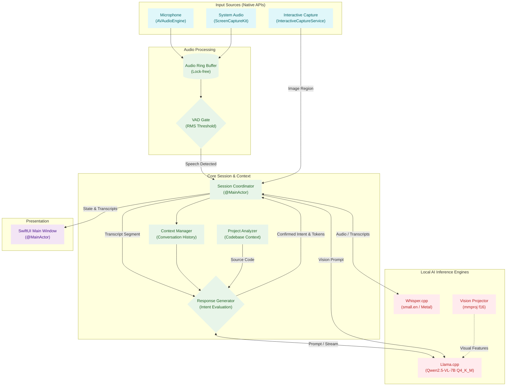

# Butler: Local AI Meeting Assistant for macOS

Butler is a privacy-first, fully on-device meeting assistant engineered for macOS. It leverages Apple's native APIs (`AVFoundation`, `ScreenCaptureKit`) alongside state-of-the-art quantized C++ engines (`whisper.cpp`, `llama.cpp`) to listen to your meetings, transcribe speech, evaluate intent in real-time, and provide instantaneous multimodal AI answers directly on your screen.

**Zero data leaves your machine. Your meetings remain entirely yours.**

## 🌟 Key Features

### 100% On-Device & Privacy-First
- **Local Inference**: Uses a quantized Qwen2.5-VL-7B model via `llama.cpp` and Whisper via `whisper.cpp` optimized specifically for Apple Silicon (Metal).
- **No Cloud APIs**: Absolutely no external API keys are required. All processing (audio transcription and LLM generation) happens locally on your machine.

### Stealth UI (Invisible to Screen Sharing)
- **Undetectable Interface**: Butler's floating UI is engineered using native macOS window APIs (`NSWindow.SharingType.none`). This guarantees that the assistant window is **completely invisible to screen-sharing applications** like Zoom, Microsoft Teams, and Google Meet.
- **Unobtrusive Design**: Runs as a lightweight Menu Bar accessory, allowing you to seamlessly pull up answers without disrupting your workflow or compromising privacy during presentations.

### Multimodal Context, Codebase Understanding & Real-Time Intelligence
- **Audio Intelligence**: Real-time microphone and system audio capture with Voice Activity Detection (VAD)-gated speech recognition. Includes granular UI toggles to select specific audio sources.
- **Deep Codebase Context**: Includes `ProjectAnalyzer` for deep source extraction, enabling the assistant to understand and answer questions about local repositories seamlessly without context truncation. On launch, Butler automatically detects missing binary state and flags projects that need re-analysis.
- **Vision Capabilities**: Contextual screen awareness. Take interactive screenshots (`Shift + Option + A`) and seamlessly ask questions about the screen content using the multimodal vision model (`mmproj`).
- **Low-Latency Partial Evaluation**: Supports custom speech vocabulary for domain-specific jargon and evaluates incomplete transcripts mid-sentence for ultra-low latency responses.
- **Advanced State Saving**: Implements intelligent KV Cache saving (`saveState` / `loadState`) to avoid constantly reprocessing static context like project codebase summaries.
- **Multi-Turn Conversation Memory**: Properly formatted conversation history is maintained across turns, enabling coherent multi-step dialogues with the AI.

### Reliability & Code Quality
- **Structured Logging**: All orchestration layers use `os.Logger` (replacing `print()`) for efficient, filterable, and privacy-respecting log output visible in Console.app.
- **Swift 6 Strict Concurrency**: The entire codebase is fully compliant with Swift 6 strict concurrency rules. `SessionCoordinator` is `@MainActor`-bound, and all cross-actor data flows are properly isolated — eliminating data races at compile time.
- **Resilient Model Downloads**: `ModelDownloader` automatically retries failed downloads up to **3 times** and validates model integrity via **SHA-256 checksum** when available, ensuring you never run a corrupted model.

### Automated Setup & CI/CD
- **One-Click Model Downloads**: The app handles automated model downloading natively (`ModelDownloader`), removing the need for manual setup scripts.
- **CI/CD Pipeline**: GitHub Actions workflows are integrated for automated testing and release deployment.

## 🏗 Architecture Overview




## 💻 System Requirements

Because Butler runs heavy AI models fully on-device, it requires robust hardware to ensure real-time performance.

- **Processor**: Apple Silicon Mac (M1, M2, M3, M4, M5 series)
- **Memory (RAM)**: Minimum 16GB Unified Memory (Recommended to run Qwen2.5-VL-7B comfortably alongside macOS).
- **OS**: macOS 14.0 (Sonoma) or newer.
- **Development**: Xcode 15+ (if building from source).

## 🚀 Installation & Setup

1. **Clone the repository and initialize submodules:**
   ```bash
   git clone --recursive https://github.com/BGYKanishka/butler.git
   cd butler
   ```

2. **Build the Project:**
   Open the Xcode project and build.
   ```bash
   open butler.xcodeproj
   ```
   *(Note: The app will automatically handle downloading and verifying models securely when you first configure it in settings. Downloads are retried automatically on failure and validated via SHA-256 checksum.)*

## 🕹 Usage

- **`Shift + Option + S`**: Start or stop the listening session anywhere.
- **`Shift + Option + W`**: Toggle the AI floating window.
- **`Shift + Option + A`**: Trigger screen vision analysis (take a partial screenshot to feed context to the AI).
- **Menu Bar**: Access Settings to configure your microphone, tune the AI temperature, choose performance profiles (Fast / Balanced / Quality), and manage privacy permissions.

## 🔒 Permissions

On the first run, Butler will request **Microphone** and **Screen Recording** permissions. These are essential for capturing your voice and system audio. No audio or visual data is ever saved to disk or transmitted externally.

## ⚠️ Disclaimer

**Butler is an open-source project.** 
**🤖 AI Limitations:** The on-device AI models used by Butler can make mistakes, hallucinate facts, or misinterpret audio. Always independently verify important information and action items.

Running local AI models (especially Vision-Language Models) is incredibly resource-intensive. This software will consume significant RAM and CPU/GPU power, which may cause your machine to run hot or drain battery quickly. 

By using this software, you acknowledge that it is provided "as is" without any warranties. The creator is not liable for any hardware issues, data loss, or system instability that may occur. Additionally, please ensure you comply with your local recording laws and corporate privacy policies when using this tool in meetings.

## 📄 License

This project is licensed under the MIT License - see the [LICENSE](LICENSE) file for details.
