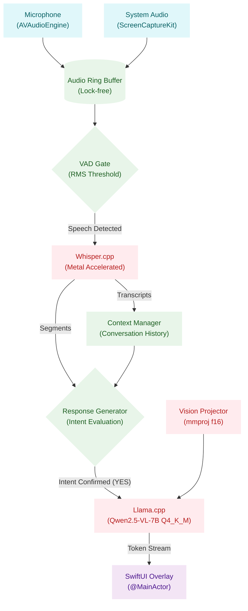

# Butler

Butler is a real-time, privacy-first meeting assistant for macOS that runs entirely locally. It uses Apple's native APIs (`AVFoundation`, `ScreenCaptureKit`) alongside state-of-the-art quantized C++ engines (`whisper.cpp`, `llama.cpp`) to listen to your meetings, transcribe speech, evaluate intent in real-time using an LLM, and provide instantaneous AI answers directly on your screen.

**Zero data leaves your machine.**

## Architecture Overview



## Requirements
- Apple Silicon Mac (M1/M2/M3/M4)
- macOS 14.0 (Sonoma) or newer
- Xcode 15+ 

## Setup
1. Clone the repository and initialize submodules:
   ```bash
   git clone --recursive https://github.com/BGYKanishka/butler.git
   ```
2. Run the bootstrap script to compile `whisper.cpp` and `llama.cpp` for Metal acceleration:
   ```bash
   cd butler
   ./Scripts/bootstrap.sh
   ```
   *(Note: The bootstrap script will automatically run `download_models.sh` to download the necessary Whisper and Llama/Qwen models.)*
   
3. Open the project and build:
   ```bash
   open butler.xcodeproj
   ```
   *(Note: You can also use `xcodegen generate` if needed, which the bootstrap script already handles.)*

## Usage
- Press `Option + Command + Space` anywhere to start/stop listening.
- Press `Option + Command + A` to toggle the AI floating overlay.
- Navigate to the Menu Bar icon to access Preferences, where you can select your microphone, tune the AI temperature, choose the model profile (Fast / Balanced / Quality — these adjust inference parameters such as temperature, max tokens, and thread count, all using the same `Qwen2.5-VL-7B Q4_K_M` model), and manage privacy settings.

## Permissions
On the first run, Butler will request Microphone and Screen Recording permissions. These are required to capture your voice and the system audio (from Zoom/Teams/Meet). No audio is saved to disk unless explicitly enabled in Preferences.
